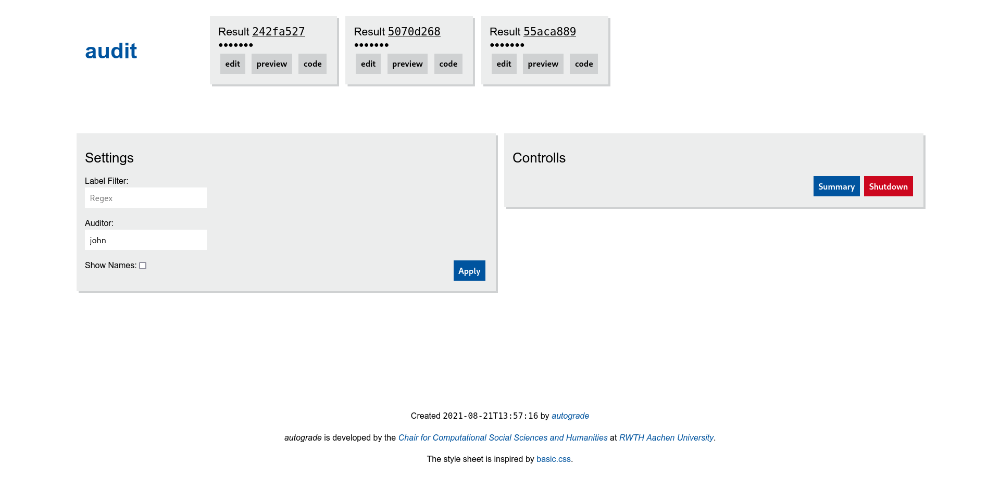
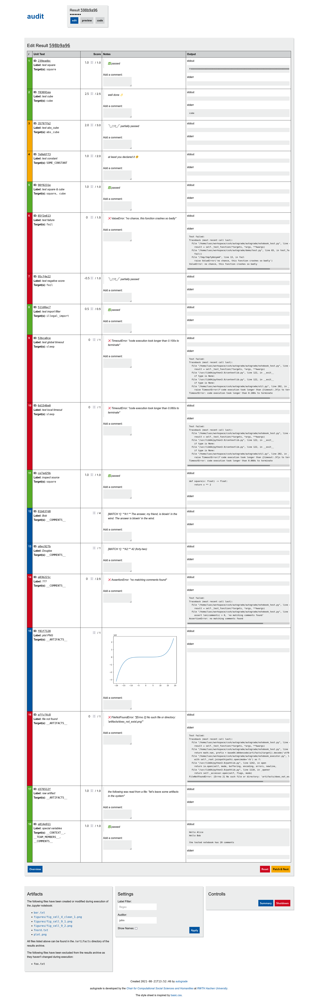
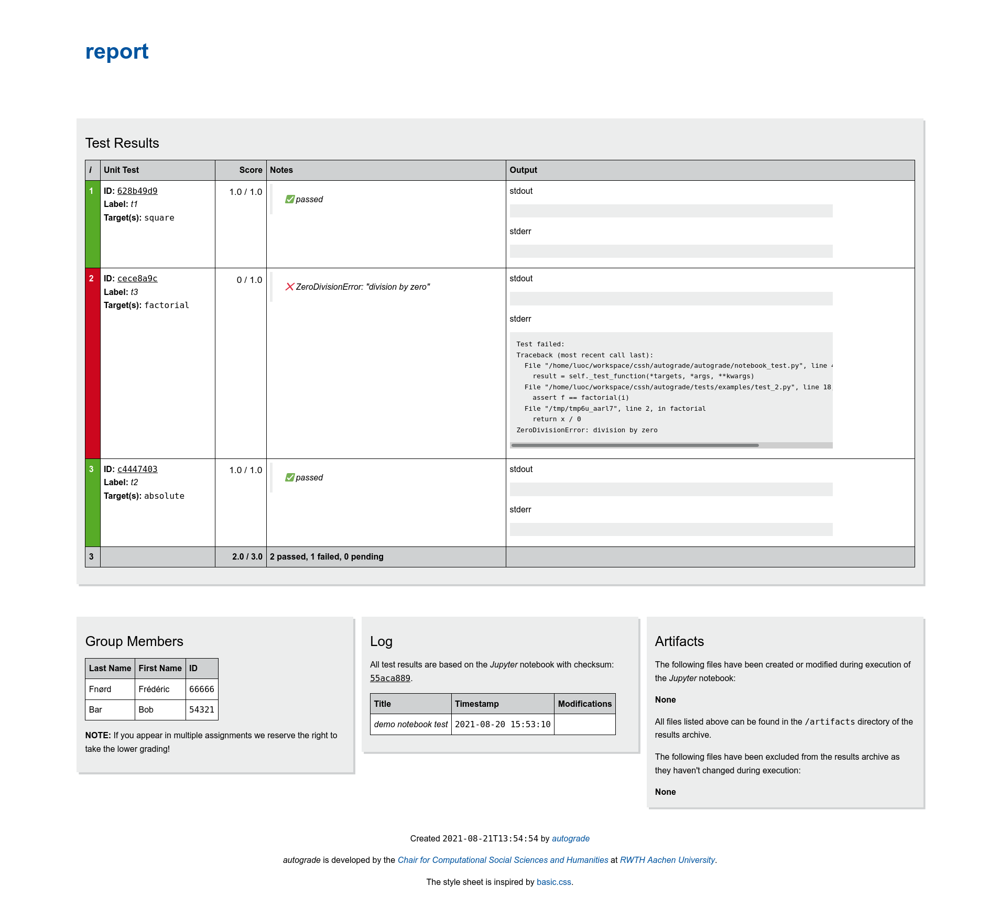

# autograde

[](https://github.com/cssh-rwth/autograde/actions)
[](https://pypi.org/project/jupyter-autograde)

*autograde* is a toolbox for testing *Jupyter* notebooks. Its features include execution of notebooks (optionally
isolated via docker/podman) with consecutive unit testing of the final notebook state. An audit mode allows for refining
results (e.g. grading plots by hand). Eventually, *autograde* can summarize these results in human and machine-readable
formats.

## setup

Install _autograde_ from _PyPI_ using _pip_ like this

```shell
pip install jupyter-autograde
```

Alternatively, _autograde_ can be set up from source code by cloning this repository and installing it
using [poetry](https://python-poetry.org/docs/)

```shell
git clone https://github.com/cssh-rwth/autograde.git && cd autograde
poetry install
```

If you intend to use autograde in a sandboxed environment
ensure [rootless docker](docs.docker.com/engine/security/rootless/) or [podman](podman.io/getting-started/installation)
are available on your system. So far, only rootless mode is supported!

## Usage

Once installed, *autograde* can be invoked via the`autograde` command. If you are using a virtual environment (which
poetry does implicitly) you may have to activate it first. Alternative methods:

- `path/to/python -m autograde` runs *autograde* with a specific python binary, e.g. the one of your virtual
  environment.
- `poetry run autograde` if you've installed *autograde* from source

To get an overview over all options available, run

```shell
autograde [sub command] --help
```

### Testing

*autograde* comes with some example files located in the `demo/`
subdirectory that we will use for now to illustrate the workflow. Run

```shell
autograde test demo/test.py demo/notebook.ipynb --target /tmp --context demo/context
```

What happened? Let's first have a look at the arguments of *autograde*:

- `demo/test.py` a script with test cases we want to apply
- `demo/notebook.ipynb` is the a notebook to be tested (here you may also specify a directory to be recursively searched
  for notebooks)
- The optional flag `--target` tells *autograde* where to store results, `/tmp` in our case, and the current working
  directory by default.
- The optional flag `--context` specifies a directory that is mounted into the sandbox and may contain arbitrary files
  or subdirectories. This is useful when the notebook expects some external files to be present such as data sets.

The output is a compressed archive that is named something like
`results_[Lastname1,Lastname2,...]_XXXXXXXX.zip` and which has the following contents:

- `artifacts/`: directory with all files that where created or modified by the tested notebook as well as rendered
  matplotlib plots.
- `code.py`: code extracted from the notebook including
  `stdout`/`stderr` as comments
- `notebook.ipynb`: an identical copy of the tested notebook
- `restults.json`: test results

### Audit Mode

The interactive audit mode allows for manual refining the result files. This is useful for grading parts that cannot be
tested automatically such as plots or text comments.

```shell
autograde audit path/to/results
```

**Overview**
[](assets/overview.png)

**Auditing**
[](assets/audit.png)

**Report Preview**
[](assets/report.png)

### Generate Reports

The `report` sub command creates human readable HTML reports from test results:

```shell
autograde report path/to/result(s)
```

The report is added to the results archive inplace.

### Patch Result Archives

Results from multiple test runs can be merged via the `patch` sub command:

```shell
autograde patch path/to/result(s) /path/to/patch/result(s)
```

### Summarize Multiple Results

In a typical scenario, test cases are not just applied to one notebook but many at a time. Therefore, *autograde* comes
with a summary feature, that aggregates results, shows you a score distribution and has some very basic fraud detection.
To create a summary, simply run:

```shell
autograde summary path/to/results
```

Two new files will appear in the result directory:

- `summary.csv`: aggregated results
- `summary.html`: human readable summary report

## Snippets

**Work with result archives programmatically**

Fix score for a test case in all result archives:

```python
from pathlib import Path

from autograde.backend.local.util import find_archives, traverse_archives


def fix_test(path: Path, faulty_test_id: str, new_score: float):
    for archive in traverse_archives(find_archives(path), mode='a'):
        results = archive.results.copy()
        for faulty_test in filter(lambda t: t.id == faulty_test_id, results.unit_test_results):
            faulty_test.score_max = new_score
            archive.inject_patch(results)


fix_test(Path('...'), '...', 13.37)
```

**Special Test Cases**

Ensure a student id occurs at most once:

```python
from collections import Counter

from autograde import NotebookTest

nbt = NotebookTest('demo notebook test')


@nbt.register(target='__TEAM_MEMBERS__', label='check for duplicate student id')
def test_special_variables(team_members):
    id_counts = Counter(member.student_id for member in team_members)
    duplicates = {student_id for student_id, count in id_counts.items() if count > 1}
    assert not duplicates, f'multiple members share same id ({duplicates})'
```


